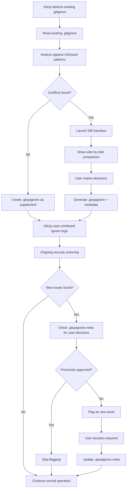

# GitUp Workflow Solution - The .gitupignore Approach

## Problem Statement

When GitUp encounters existing projects with existing .gitignore files, we face conflicts:
- User's .gitignore may not meet GitGuard security standards
- GitUp needs to respect user choices while maintaining security
- False positives occur when legitimate files are flagged as security issues

## Solution: The .gitupignore System

### Core Concept
Create a **parallel ignore system** that works alongside .gitignore:

```
.gitignore          # User's original ignore patterns
.gitupignore        # GitUp's security-focused ignore patterns
.gitupignore.meta   # Metadata, audit trail, user decisions
```

### Workflow Implementation



### The Diff Interface

```
╭─────────────────────────────────────────────────────────────────────────────────────╮
│                           GitUp Security Review                                     │
├─────────────────────────────────────────────────────────────────────────────────────┤
│  Current .gitignore              │  Suggested .gitupignore                          │
│                                  │                                                   │
│  # Python                        │  # Python                                        │
│  __pycache__/                    │  __pycache__/                                     │
│  *.pyc                           │  *.pyc                                            │
│                                  │                                                   │
│  # Missing security patterns     │  # GitUp Security Additions                      │
│                                  │  *.env                    [SECURITY]              │
│                                  │  *.key                    [SECURITY]              │
│                                  │  config/secrets.json      [SECURITY]              │
│                                  │  Data/Databases/*.db      [SECURITY]              │
│                                  │                                                   │
│  # User patterns                 │  # Potential conflicts                           │
│  my_config.json                  │  # my_config.json         [REVIEW NEEDED]        │
│  data/*.csv                      │  # data/*.csv             [REVIEW NEEDED]        │
│                                  │                                                   │
├─────────────────────────────────────────────────────────────────────────────────────┤
│  Actions:                                                                           │
│  [A] Accept all GitUp suggestions    [R] Reject all                                 │
│  [M] Merge files                     [C] Create .gitupignore only                   │
│  [I] Review each item individually   [H] Help & Documentation                       │
╰─────────────────────────────────────────────────────────────────────────────────────╯
```

### Individual Item Review

```
╭─────────────────────────────────────────────────────────────────────────────────────╮
│  File: my_config.json                                                              │
│  Status: Potential Security Risk                                                   │
│  Reason: Contains 'config' pattern, may contain sensitive data                     │
│                                                                                     │
│  File contents preview:                                                            │
│  {                                                                                  │
│    "app_name": "My App",                                                            │
│    "version": "1.0.0",                                                              │
│    "api_endpoint": "https://api.example.com"                                       │
│  }                                                                                  │
│                                                                                     │
│  Options:                                                                           │
│  [S] Safe - Add to .gitupignore (keep tracking)                                    │
│  [I] Ignore - Add to .gitignore (stop tracking)                                    │
│  [R] Rename - Suggest safer filename                                               │
│  [E] Edit - Remove sensitive data                                                   │
│  [?] Help - Learn about this security pattern                                      │
╰─────────────────────────────────────────────────────────────────────────────────────╯
```

## .gitupignore.meta Structure

```json
{
  "version": "1.0.0",
  "created": "2025-07-15T14:30:00Z",
  "project_type": "python-web",
  "security_level": "medium",
  "user_decisions": {
    "my_config.json": {
      "decision": "safe",
      "reason": "Contains only public configuration",
      "timestamp": "2025-07-15T14:35:00Z",
      "auto_review": "2025-08-15T14:35:00Z"
    },
    "data/sample.csv": {
      "decision": "ignore",
      "reason": "Contains sample data only",
      "timestamp": "2025-07-15T14:36:00Z",
      "auto_review": "never"
    }
  },
  "audit_trail": [
    {
      "action": "created",
      "timestamp": "2025-07-15T14:30:00Z",
      "user": "herb",
      "gitup_version": "0.2.0"
    },
    {
      "action": "decision",
      "file": "my_config.json",
      "decision": "safe",
      "timestamp": "2025-07-15T14:35:00Z"
    }
  ],
  "auto_review_schedule": "monthly",
  "security_updates": {
    "last_check": "2025-07-15T14:30:00Z",
    "next_check": "2025-08-15T14:30:00Z"
  }
}
```

## Implementation Strategy

### Phase 1: Core .gitupignore System
```python
class GitUpIgnoreManager:
    def __init__(self, project_path):
        self.project_path = project_path
        self.gitignore_path = project_path / '.gitignore'
        self.gitupignore_path = project_path / '.gitupignore'
        self.metadata_path = project_path / '.gitupignore.meta'
    
    def analyze_existing_gitignore(self):
        """Analyze existing .gitignore for security gaps"""
        pass
    
    def create_diff_interface(self):
        """Launch interactive diff interface"""
        pass
    
    def generate_gitupignore(self, user_decisions):
        """Generate .gitupignore based on user decisions"""
        pass
    
    def should_ignore_file(self, file_path):
        """Check if file should be ignored (combines .gitignore + .gitupignore)"""
        pass
```

### Phase 2: Interactive Diff Interface
```python
class GitUpDiffInterface:
    def __init__(self, existing_gitignore, suggested_patterns):
        self.existing = existing_gitignore
        self.suggested = suggested_patterns
    
    def show_side_by_side(self):
        """Display side-by-side comparison"""
        pass
    
    def review_individual_items(self):
        """Let user review each conflict individually"""
        pass
    
    def generate_final_config(self):
        """Generate final .gitupignore + metadata"""
        pass
```

### Phase 3: GitGuard Integration
```python
# Modified GitGuard integration
class GitGuardValidator:
    def __init__(self, project_path):
        self.ignore_manager = GitUpIgnoreManager(project_path)
    
    def should_scan_file(self, file_path):
        """Check both .gitignore and .gitupignore + user decisions"""
        # Check .gitignore
        if self.is_git_ignored(file_path):
            return False
        
        # Check .gitupignore
        if self.ignore_manager.should_ignore_file(file_path):
            return False
        
        # Check user decisions
        if self.ignore_manager.is_user_approved(file_path):
            return False
        
        return True
```

## Benefits of This Approach

### For Users
- **Non-destructive**: Original .gitignore remains unchanged
- **Granular control**: Review each security decision
- **Learning opportunity**: Understand security implications
- **Audit trail**: Track decisions over time

### For GitUp
- **Flexible**: Works with any existing .gitignore
- **Secure**: Maintains security standards
- **Scalable**: Easy to add new security patterns
- **Maintainable**: Clear separation of concerns

### For Teams
- **Collaborative**: Teams can share .gitupignore patterns
- **Consistent**: Same security standards across projects
- **Transparent**: Clear audit trail of security decisions
- **Flexible**: Team-specific overrides possible

## CLI Commands

```bash
# Initialize .gitupignore for existing project
gitup ignore init

# Review current ignore status
gitup ignore status

# Launch diff interface
gitup ignore review

# Add specific pattern to .gitupignore
gitup ignore add "*.env"

# Remove pattern from .gitupignore
gitup ignore remove "my_config.json"

# Show ignore decisions audit trail
gitup ignore audit

# Update security patterns
gitup ignore update
```

## GUI Interface Concept

You mentioned a GUI interface might be needed - I think you're right! The diff interface could be:

1. **Terminal-based TUI** (like `lazygit`)
2. **Web-based interface** (launches in browser)
3. **VS Code extension** (integrates with IDE)
4. **Electron app** (standalone application)

## Next Steps for POC

1. **Implement basic .gitupignore system**
2. **Create simple diff interface (terminal-based)**
3. **Integrate with GitGuard scanning**
4. **Add user decision tracking**
5. **Test with real projects**

This approach solves the core problem while maintaining flexibility and user control. What do you think about this direction?